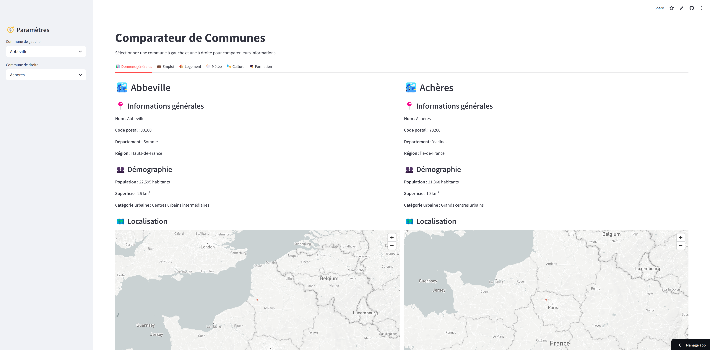
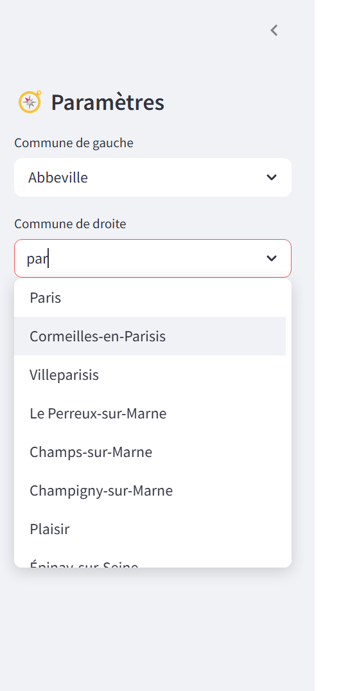
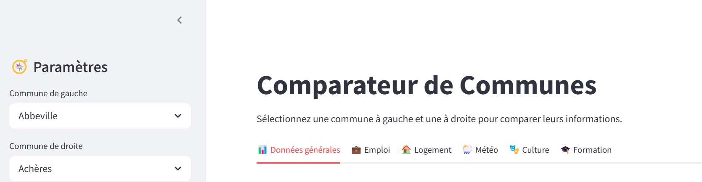

# City Fighter - Comparaison entre deux villes

## Présentation

L'objectif de ce projet est de comparer deux villes selon plusieurs critères (démographie, emploi, logement, météo, culture) en utilisant des données ouvertes (APIs publiques et bases de données nationales).  
L'application permet à l'utilisateur de sélectionner deux villes et d'obtenir des comparaisons interactives à l'aide de visualisations modernes.

Lien de l'application : [💥🏙️City Fighter](https://cityfighter-da-silva-narin-houitte.streamlit.app/)
## Structure du projet
```sh
CITY/
├── app.py
├── data/
│   ├── communes_synthetique.csv
│   ├── communes-france-2025 (1).csv
│   ├── guide-utilisation-des-donnees.pdf
│   ├── pred-app-mef-dhup.csv
├── utils/
│   ├── clim.py
│   ├── climat.py
│   ├── csv_traitement.py
│   ├── loyer.py
│   ├── meteo.py
│   └── wiki.py


```
##  Getting Started

**System Requirements:**

* **Python**: `version 3.`

###  Installation

<h4>From <code>source</code></h4>

> 1. Clone the  repository:
>
> ```console
> git clone https://github.com/pit9111/city_fighter.git
> ```
>
> 2. Change to the project directory:
> ```console
> cd ./city_fighter
> ```
>
> 3. Create a virtualenv:
> ```console
> python -m venv env
> ```
>

>
> 4. Launch the virtualenv
> ```console
> env\Scripts\activate


> 5. Install the dependencies:
> ```console
> pip install -r requirements.txt
>
> ```

> 6. Launch the apps:
> ```console
> python -m streamlit run app.py
>
> ```
>

# 📖 Mode d'emploi de l'interface

## 1. Vue globale de l'application
L'application se présente sous la forme d'une interface simple et épurée.  
À gauche, vous trouverez la barre latérale pour sélectionner les communes à comparer.  
Au centre et à droite, les informations s'affichent dans des onglets thématiques.



---

## 2. Sélection des communes
Dans la barre latérale, sélectionnez la **commune de gauche** et la **commune de droite** via des menus déroulants.  
Vous pouvez choisir n'importe quelle ville disponible dans la base.



---

## 3. Présentation des onglets
Après avoir sélectionné vos communes, naviguez à travers les différents **onglets** pour explorer les informations :  
- 📊 Données générales
- 💼 Emploi
- 🏠 Logement
- 🌦️ Météo
- 🎭 Culture
- 🎓 Formation

Chaque onglet affiche les données comparatives entre les deux communes.




